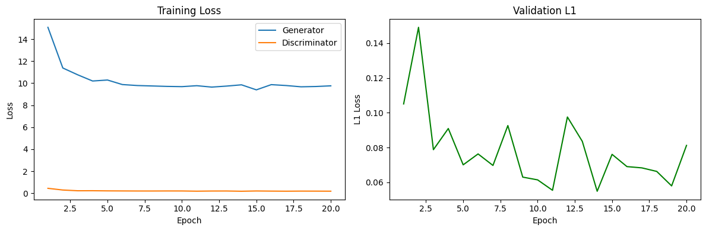
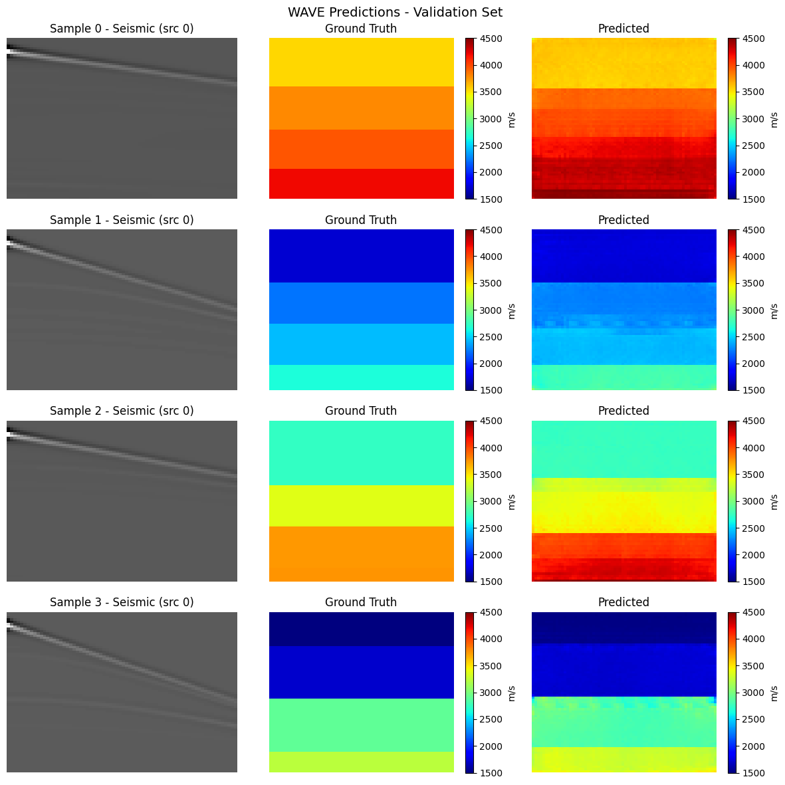

# WAVE - Waveform Analysis and Velocity Estimation

A deep learning project for reconstructing subsurface velocity maps from seismic shot-gather data, using a VelocityGAN-style model trained on the OpenFWI FlatVel-A benchmark dataset.


## Problem Statement

Full Waveform Inversion (FWI) estimates subsurface velocity structures from recorded seismic waveforms. Traditional FWI is computationally expensive and requires careful physical modeling. This project takes a data-driven approach where a neural network learns the seismic-to-velocity mapping directly from examples.

- **Input:** seismic shot-gather data `(5 sources x 1000 time steps x 70 receivers)`
- **Output:** 2D velocity map `(70 x 70 spatial grid)`


## Dataset

**OpenFWI FlatVel-A** is a synthetic benchmark dataset of flat-layered velocity models with corresponding seismic shot-gather data.

- Source: [https://openfwi-lanl.github.io/](https://openfwi-lanl.github.io/)
- Velocity range: 1500 to 4500 m/s
- Training samples: 24,000 | Validation samples: 6,000

## Approach

The model uses a VelocityGAN-style setup with supervised training:

- **Generator:** CNN encoder-decoder that maps seismic input to a velocity map
- **Discriminator:** CNN that classifies velocity maps as real or generated
- **Loss:** L1 reconstruction loss combined with adversarial loss (BCE)

## Repository Structure

```
WAVE/
├── README.md
├── requirements.txt
├── config.yaml
├── .gitignore
├── results/
│   ├── predictions.png
│   └── training_curves.png
└── src/
    ├── dataset.py
    ├── models.py
    ├── train.py
    ├── evaluate.py
    └── visualize.py
```

## Setup

```bash
git clone https://github.com/shah-suhani/WAVE.git
cd WAVE
pip install -r requirements.txt
```

Download FlatVel-A from [OpenFWI](https://openfwi-lanl.github.io/) and organize as:

```
data/
└── FlatVel-A/
    ├── train/
    │   ├── seismic/
    │   └── velocity/
    └── val/
        ├── seismic/
        └── velocity/
```

Update `data_root` in `config.yaml` to point to your local data folder.

## Training

```bash
python src/train.py
```

All hyperparameters are in `config.yaml`. Checkpoints are saved to `checkpoints/` automatically.


## Evaluation

```bash
python src/evaluate.py
```

Computes L1, MSE, and SSIM on the validation set. Set `checkpoint_path` in `config.yaml` before running.


## Visualization

```bash
python src/visualize.py
```

Saves side-by-side plots of seismic input, ground truth, and predicted velocity maps to `outputs/`.

## Results

Trained for 20 epochs on 24,000 samples (6,000 validation samples).

| Metric | Value |
|--------|-------|
| Val L1 (normalised) | 0.081 |
| Val MSE (normalised) | 0.021 |
| Val SSIM | 0.71 |
| Best Val L1 (normalised) | 0.055 |





## Limitations

- Trained only on FlatVel-A (flat-layered synthetic models)
- Does not generalize to curved or complex velocity structures
